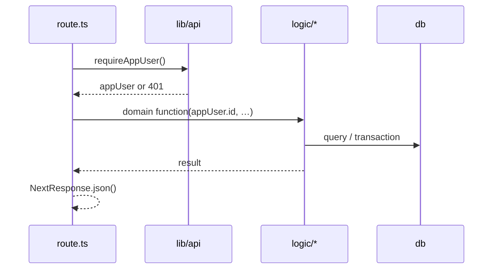

# Tornea — architecture

High-level map of the repo. Database detail: [`docs/DATABASE.md`](DATABASE.md).

## Directory layout

```
src/
├── app/                 # Next.js App Router (pages, layouts, API routes)
│   ├── (arena)/         # Authenticated operator panel (per-section URLs)
│   ├── api/             # Route handlers — thin; delegate to logic/
│   └── auth/            # OAuth callback
├── components/          # React UI (client + server components)
│   ├── dashboard/       # Operator panel
│   │   ├── hooks/       # Panel-specific client hooks
│   │   ├── layout/      # Shell chrome (header, drawer)
│   │   ├── forms/       # UI fragments + hooks (e.g. `use-new-player-form`)
│   │   ├── leagues/     # Forms; Zod lives in `src/schemas/dashboard`
│   │   ├── nav/         # Sidebar + route map
│   │   ├── tables/      # Data tables
│   │   └── views/       # One view per nav section
│   ├── landing/
│   └── providers/
├── logic/               # Business logic (server-safe)
│   ├── auth/
│   ├── leagues/
│   ├── players/
│   ├── audit/
│   └── dashboard/
├── schemas/             # Zod schemas shared by API + UI (`schemas/dashboard/`)
├── lib/                 # Shared utilities (no business rules)
│   ├── api/             # API route helpers (auth, FormData, validation JSON)
│   ├── supabase/
│   └── phone/
└── db/                  # Drizzle schema + client
```

## Request flow (API)



**Rule:** `app/api/**/route.ts` should stay thin — parse input, call `logic`, map errors to HTTP.

**Auth (standard):** every protected handler starts with:

```typescript
const auth = await requireAppUser();
if (!auth.ok) return auth.response;
const { appUser } = auth.ctx;
```

Shared helpers in `lib/api`:

- `requireAppUser` — session → `appUser`
- `readFormString` — multipart fields
- `validationErrorFromZod(parsed.error)` — Zod `safeParse` failure → `{ error, fields }` (400)
- `validationErrorResponse({ field: "msg" })` — manual field errors (e.g. fecha inválida)

## Dashboard panel

- **`(arena)/layout.tsx`** — server auth gate + mounts **`DashboardArenaShell`** once.
- **Section URLs** — `/teams`, `/leagues`, …; see `components/dashboard/nav/dashboard-routes.ts`.
- **`DashboardArenaShell`** — client: `useMyLeagues`, sign-out, passes props to layout.
- **`DashboardArenaLayout`** — chrome: nav, header, main, right rail.
- **`useDashboardDrawer`** — slide-over state and open handlers.
- **`DashboardArenaDrawer`** — renders the active form for the drawer.

## State

- **URL** — active section (`pathname` → `DashboardNavKey`).
- **`useState`** — drawers, form remount keys, pagination loading flags.
- **`useMyLeagues`** — aggregated `/api/leagues/my` payload for the shell.
- **No Redux** — not needed for current scope.

## Adding a feature (checklist)

1. **Logic** — `src/logic/<domain>/your-action.ts` (+ tests when runner exists).
2. **API** — `src/app/api/.../route.ts` using `requireAppUser` from `@/lib/api`.
3. **UI** — view under `components/dashboard/views/` or form under `leagues/`.
4. **Nav** — if new section: add key in `dashboard-nav-config.ts`, path in `dashboard-routes.ts`, `app/(arena)/<path>/page.tsx`.

## Conventions

- Prefer **named exports** for logic; default export for page components.
- Zod for dashboard forms: `src/schemas/dashboard/` (API import `@/schemas/dashboard/...`). Shims en `leagues/*-schema.ts` reexportan todo (`export *`).
- **Do not** import `@/db` from client components.
- After schema changes: `npm run db:generate` + `npm run db:migrate` (see DATABASE.md).

## Related docs

- Superpowers specs/plans: `docs/superpowers/`
- Agent rules: `AGENTS.md`
