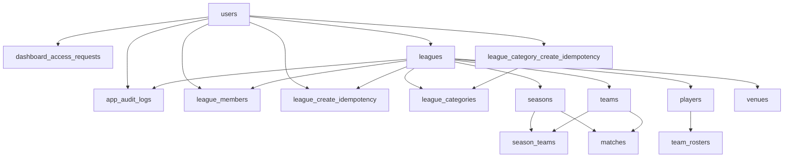

# Tornea — database design reference

Complete reference for PostgreSQL (Drizzle ORM): **enums**, **tables**, **columns**, plus **business conventions** the schema does not enforce by itself.

**Source of truth in code:** `src/db/schema.ts` (line-accurate types and FK behavior). Migrations: `drizzle/`. Apply: `npm run db:migrate` (via `scripts/migrate.cjs`, loads `.env` / `.env.local`). After schema edits: `npm run db:generate` for new migrations.

---

## Stack

- **Engine:** PostgreSQL (e.g. Supabase).
- **ORM:** Drizzle — types and queries from `src/db/schema.ts`.

---

## Entity hierarchy (multi-tenant by league)

- **`dashboard_access_requests`:** solicitudes de acceso al panel (waitlist); ver columna `users.dashboard_access_granted_at`.
- **`league_create_idempotency`:** deduplicación de creación de liga por usuario + clave de idempotencia HTTP (evita ligas duplicadas por doble envío).
- **`league_category_create_idempotency`:** deduplicación de creación de categoría (`league_categories`) por usuario + clave HTTP (evita categorías duplicadas por doble envío).
- **`league_categories`:** categorías de competencia dentro de una liga (varonil, femenil, sub-15, etc.); ver [League categories](#league-categories-varonil--femenil--sub-15--).

- **`leagues`:** Top-level organization (“tenant” for a competition).
- **`seasons`:** Competition edition under a league.
- **`teams`:** Clubs registered in a league; enrollment per season via **`season_teams`**.
- **`matches`:** Always tied to a **`season_id`**, with **`home_team_id`** and **`away_team_id`**.

---

## User identity

| Concept | Column / table | Notes |
|---------|----------------|-------|
| App user | `users.id` (UUID) | Business FKs target this. |
| Supabase login | `users.auth_user_id` (UUID, unique) | Mirrors `auth.users.id`; link on first sign-in or provisioning job. |

The database does **not** automatically insert `users` rows when someone signs up in Auth — that is application responsibility (webhook, Supabase trigger, or first-session flow).

---

## League roles

Table **`league_members`**: one row per (`league_id`, `user_id`) with a **`role`**.

A user may have **different roles in different leagues** (multiple rows). Billing / primary contact also appears as **`leagues.owner_user_id`**.

### Convention: `owner_user_id` vs role `owner`

The DB does **not** guarantee that `leagues.owner_user_id` always matches a `league_members` row with role `owner`.

**Recommended policy when creating a league:**

1. Insert **`leagues`** with **`owner_user_id`** = creating user.
2. Insert **`league_members`** for the same **`user_id`** with role **`owner`** (and **`accepted_at`** if you use invitations).

Any “transfer of ownership” should update **both** or define a single canonical rule in product.

### League create idempotency

Table **`league_create_idempotency`** stores one row per **`(user_id, idempotency_key)`** pointing at the **`league_id`** created on first successful create. Replays with the same key must return the **same** league and must **not** insert another row (`ON DELETE CASCADE` from **`leagues`** removes this row if the league is deleted — e.g. compensating rollback when Storage fails after insert).

Application code should serialize create attempts per key (e.g. `pg_advisory_xact_lock` in the same transaction as the insert) so concurrent requests do not race.

---

## League categories (varonil / femenil / sub-15 / …)

Table **`league_categories`** models **competition categories that run in parallel** inside the same league (e.g. *Apertura 2026* with Varonil and Femenil running side by side). Categories are owned **per league** (`league_id`) and are reusable across seasons.

Anchor points (both nullable for backwards compatibility — a category may not always apply):

- **`season_teams.league_category_id`** → which category a team plays in within a season.
- **`matches.league_category_id`** → which category a match belongs to.

**Convention:**

1. Define categories at the league level once.
2. When enrolling a team into a season (`season_teams`), set its **`league_category_id`** if the season is multi-category.
3. When scheduling a match (`matches`), set **`league_category_id`** (single source of truth for filtering calendars, standings, and discipline by category).
4. The DB does **not** enforce that `matches.league_category_id` matches the category of the two `season_teams`. **App validation:** both teams must be enrolled in that season **and** in that category.

`(league_id, lower(code))` is unique, so `code` (e.g. `varonil`, `femenil`, `sub_15`) is a stable key safe for URLs/UI.

For mixed-gender or unisex categories, use **`gender = 'mixed'`** (a game/category where both genders play). Use **`'unspecified'`** when the league does not track gender. Age windows are open intervals via `age_min` / `age_max` (nullable means "no limit on that side").

**`metadata` convention (app):** optional numeric **`minTeamsToStart`** (minimum teams required to start the category competition); optional **`birthYearMin`** / **`birthYearMax`** (inclusive calendar-year window for allowed birth years). These live in `metadata` when the product captures them; there is no separate SQL column for birth years.

### League category create idempotency

Table **`league_category_create_idempotency`** stores one row per **`(user_id, idempotency_key)`** pointing at the **`league_category_id`** created on first successful `POST`. Replays with the same key return the **same** category and must **not** insert another row (`ON DELETE CASCADE` from **`league_categories`** removes the mapping if the category is deleted).

Serialize create attempts per key with **`pg_advisory_xact_lock`** in the same transaction as the insert (same pattern as league creation).

---

## `sport_code`

Used on **`leagues`**, **`matches`**, and many sport-specific detail tables.

- There is **no FK** forcing a match’s **`sport_code`** to match its league’s **`sport_code`**.
- **Convention:** treat **`leagues.sport_code`** as source of truth; on create, copy from the league or **validate equality** in application code.

---

## Matches and teams

### Teams must belong to the match season

PostgreSQL does **not** enforce that **`matches.home_team_id`** / **`away_team_id`** have a **`season_teams`** row for **`matches.season_id`**.

**Validate in the app:** both teams must be enrolled in that season (`season_teams` for that `season_id` + `team_id`).

### Score vs goals

- **`matches.home_score`** / **`away_score`:** aggregate result.
- **`match_goals`:** per-goal detail.

They can **diverge** without an explicit policy.

| Approach | Description |
|----------|-------------|
| A | Score is canonical; goals are detail (validate sum when closing the match). |
| B | Goals are canonical; score is derived or read-only aggregate. |
| C | Both editable; reconcile before marking **finished**. |

Document the chosen policy in domain code.

---

## Discipline: three layers (do not conflate)

| Layer | Table(s) | Meaning |
|-------|----------|---------|
| Match sheet | `match_cards` | Yellow / red / second yellow shown on the official record. |
| Incidents / fouls | `match_fouls` | What happened on the pitch (violent conduct, tackle, etc.). Optional **`match_card_id`** if a card was shown. |
| Competition discipline | `sanctions` | Fines, match bans, committee records. Optional link from **`match_fouls.league_sanction_id`**. |

**Naming:** `sanction_kind` includes **`warning`** (a **league** disciplinary warning). That is **not** the same as a yellow card in **`match_cards`**.

---

## Football match detail (extensible via `sport_code` + `metadata`)

Dedicated tables cover structured football data. Default **`sport_code`** is **`football`** unless you evolve multi-sport.

---

## Generic match events vs dedicated tables

**`sport_match_events`** is for VAR-style keys, injuries, stoppages, etc., **without** duplicating rows that belong in **`match_cards`**, **`match_fouls`**, **`match_goals`**, etc.

**Convention:** use specific tables for structured data; use **`sport_match_events`** for integrations or events that do not yet have a first-class table. Stable **`event_key`** convention (e.g. `football.var_review`).

---

## Security and auditing

- The schema enforces **referential integrity** (FKs, `ON DELETE` / `ON UPDATE` behavior).
- It does **not** define **who** may read or write which row (multi-tenant authorization).

With Supabase, you typically add **Row Level Security (RLS)** and policies keyed by **`league_id`** / membership. Required for production if clients hit the DB or exposed APIs directly.

### App audit log (web dashboard)

Table **`app_audit_logs`** stores **append-only** events from the web app: which **`users`** row acted (`actor_user_id`), optional **role in league** at event time (`actor_league_role`), action (`create` / `update` / `delete`), entity type/id, short **`summary`**, and **`metadata`** JSON. Used for “Actividad reciente” (Agenda / Pendientes) and cross-cutting audit.

- **Design and integration:** [AUDIT_LOGS.md](./AUDIT_LOGS.md).
- **Code:** `src/logic/audit/` (`recordAppAuditLog`, `listRecentAppAuditLogsForLeague`).

---

## Enums (PostgreSQL types)

| Enum | Values |
|------|--------|
| `league_status` | `draft`, `active`, `archived` |
| `league_billing_status` | `trial`, `active`, `past_due`, `cancelled` |
| `league_member_role` | `owner`, `admin`, `staff`, `referee`, `team_staff`, `viewer` |
| `league_category_gender` | `male`, `female`, `mixed`, `unspecified` |
| `season_status` | `scheduled`, `in_progress`, `completed`, `cancelled` |
| `season_format` | `round_robin`, `groups`, `knockout`, `mixed` |
| `team_status` | `active`, `inactive`, `withdrawn` |
| `match_status` | `scheduled`, `live`, `finished`, `postponed`, `cancelled`, `walkover` |
| `sanction_kind` | `suspension`, `fine`, `warning`, `ban` |
| `sanction_status` | `active`, `served`, `appealed`, `revoked` |
| `football_goal_kind` | `open_play`, `penalty_kick`, `direct_free_kick`, `indirect_free_kick`, `corner`, `header`, `other` |
| `football_card_kind` | `yellow`, `red`, `second_yellow` |
| `football_period` | `first_half`, `second_half`, `extra_first`, `extra_second`, `penalty_shootout` |
| `football_penalty_attempt_outcome` | `scored`, `saved`, `missed`, `off_target`, `disallowed` (in-game penalty kick, not shootout rounds) |
| `lineup_slot` | `starter`, `bench` |
| `match_report_kind` | `delegate`, `referee`, `press`, `internal` |
| `football_foul_kind` | `violent_conduct`, `serious_foul_play`, `reckless_tackle`, `careless_foul`, `dissent`, `unsporting_behavior`, `handball`, `offside`, `simulation`, `other` |
| `app_audit_action` | `create`, `update`, `delete` |

---

## Tables and columns

Column names below match **SQL** (snake_case). Types: **uuid**, **text**, **boolean**, **integer**, **date**, **timestamptz** (stored as `timestamp with time zone`), **jsonb**, **enum** (see above).

### `users`

Application profile linked to Supabase Auth.

| Column | Type | Description |
|--------|------|-------------|
| `id` | uuid PK | Internal user id; FK target for app logic. |
| `auth_user_id` | uuid UNIQUE NOT NULL | Supabase `auth.users.id`. |
| `email` | text NOT NULL | Login email; unique index on `lower(email)`. |
| `display_name` | text | Display name. |
| `avatar_url` | text | Profile image URL. |
| `phone` | text | Phone number. |
| `dashboard_access_granted_at` | timestamptz | When set, the user may use the product dashboard (invite-only). |
| `locale` | text NOT NULL DEFAULT `es` | Locale preference. |
| `created_at` | timestamptz NOT NULL | Creation time. |
| `updated_at` | timestamptz NOT NULL | Last update. |

### `dashboard_access_requests`

Waitlist / intake for users requesting **dashboard access** (before `users.dashboard_access_granted_at` is set).

| Column | Type | Description |
|--------|------|-------------|
| `id` | uuid PK | Row id. |
| `user_id` | uuid FK → `users.id` | Submitter (cascade delete). |
| `contact_full_name` | text NOT NULL | Contact name. |
| `whatsapp_number` | text NOT NULL | WhatsApp / mobile (ideally E.164). |
| `leagues_managed_count` | integer NOT NULL | Self-reported league count. |
| `tournaments_summary` | text NOT NULL | Free-text tournament experience. |
| `organization_name` | text | Optional org name. |
| `city_or_region` | text | Optional location. |
| `referral_source` | text | Optional attribution. |
| `approximate_players_count` | integer | Optional sizing hint. |
| `extra_notes` | text | Optional notes. |
| `created_at` | timestamptz NOT NULL | Submission time. |

Indexes: `user_id`, `created_at`.

### `app_audit_logs`

Bitácora de acciones desde la **app web** (dashboard). Filas **solo insert** desde código servidor; no actualizar ni borrar salvo políticas operativas (retención).

| Column | Type | Description |
|--------|------|-------------|
| `id` | uuid PK | Event id. |
| `actor_user_id` | uuid FK → `users.id` | Usuario que realizó la acción (`ON DELETE SET NULL`). |
| `actor_display_name_snapshot` | text | Copia de `users.display_name` al momento del evento. |
| `actor_email_snapshot` | text | Copia de `users.email` al momento del evento. |
| `actor_league_role` | `league_member_role` | Rol en `league_id` al momento del evento (o inferido; ver [AUDIT_LOGS.md](./AUDIT_LOGS.md)). |
| `league_id` | uuid FK → `leagues.id` | Alcance de liga para listados (`ON DELETE SET NULL`). |
| `action` | `app_audit_action` NOT NULL | `create` / `update` / `delete`. |
| `entity_type` | text NOT NULL | Recurso lógico (convención `snake_case`, p. ej. `player`, `team`). |
| `entity_id` | uuid | Id de la fila afectada, si aplica. |
| `summary` | text NOT NULL | Texto corto para feed / UI. |
| `metadata` | jsonb NOT NULL | Contexto extra (equipo, temporada, etc.). |
| `created_at` | timestamptz NOT NULL | Momento del evento. |

Indexes: (`league_id`, `created_at`), (`actor_user_id`, `created_at`), (`entity_type`, `entity_id`).

### `leagues`

League / organization (tenant).

| Column | Type | Description |
|--------|------|-------------|
| `id` | uuid PK | League id. |
| `owner_user_id` | uuid FK → `users.id` | Primary owner (restrict on delete). |
| `slug` | text NOT NULL | URL slug; unique per `lower(slug)`. |
| `name` | text NOT NULL | Display name. |
| `sport_code` | text NOT NULL DEFAULT `football` | Sport identifier (no FK to a catalog). |
| `country_code` | text | Country (e.g. ISO). |
| `timezone` | text NOT NULL DEFAULT `America/Guayaquil` | Default timezone for scheduling. |
| `status` | `league_status` NOT NULL DEFAULT `draft` | Lifecycle. |
| `billing_status` | `league_billing_status` NOT NULL DEFAULT `trial` | Billing state. |
| `branding` | jsonb NOT NULL DEFAULT `{}` | Logos, colors, etc. **Convention (app):** optional **`shield`** object after upload to Storage: `bucket`, `path`, `publicUrl`, `contentType`. |
| `rules` | jsonb NOT NULL DEFAULT `{}` | League rules payload. |
| `settings` | jsonb NOT NULL DEFAULT `{}` | Feature flags and settings. **Convention (app):** onboarding contact under **`contact`** (e.g. `fullName`, `email`, `whatsappE164`, `organizationAddress`, `whatsappCountryIso2`) until first-class columns exist. |
| `created_at` | timestamptz NOT NULL | Creation time. |
| `updated_at` | timestamptz NOT NULL | Last update. |

### `league_members`

Membership and role per league.

| Column | Type | Description |
|--------|------|-------------|
| `id` | uuid PK | Row id. |
| `league_id` | uuid FK → `leagues.id` | League (cascade delete). |
| `user_id` | uuid FK → `users.id` | User (cascade delete). |
| `role` | `league_member_role` NOT NULL DEFAULT `viewer` | Role in this league. |
| `invited_by_user_id` | uuid FK → `users.id` | Who sent the invite (set null on delete). |
| `accepted_at` | timestamptz | When membership was accepted. |
| `created_at` | timestamptz NOT NULL | Creation time. |
| `updated_at` | timestamptz NOT NULL | Last update. |

Unique: (`league_id`, `user_id`).

### `league_create_idempotency`

Dedupes **league creation** per app user and HTTP idempotency key (see [League create idempotency](#league-create-idempotency)).

| Column | Type | Description |
|--------|------|-------------|
| `user_id` | uuid FK → `users.id` | Creating user (cascade delete). PK part 1. |
| `idempotency_key` | text NOT NULL | Opaque client key (e.g. UUID). PK part 2. |
| `league_id` | uuid FK → `leagues.id` | League created on first success (cascade delete). |
| `created_at` | timestamptz NOT NULL | When the mapping was stored. |

Primary key: (`user_id`, `idempotency_key`). Index: `league_id`.

### `league_category_create_idempotency`

Dedupes **league category creation** per app user and HTTP idempotency key (same pattern as **`league_create_idempotency`**).

| Column | Type | Description |
|--------|------|-------------|
| `user_id` | uuid FK → `users.id` | Creating user (cascade delete). PK part 1. |
| `idempotency_key` | text NOT NULL | Opaque client key (e.g. UUID). PK part 2. |
| `league_category_id` | uuid FK → `league_categories.id` | Category created on first success (cascade delete). |
| `created_at` | timestamptz NOT NULL | When the mapping was stored. |

Primary key: (`user_id`, `idempotency_key`). Index: `league_category_id`.

### `league_categories`

Competition categories (e.g. *Varonil*, *Femenil*, *Sub-15*) inside a league. See [League categories](#league-categories-varonil--femenil--sub-15--).

| Column | Type | Description |
|--------|------|-------------|
| `id` | uuid PK | Category id. |
| `league_id` | uuid FK → `leagues.id` | Owning league (cascade delete). |
| `code` | text NOT NULL | Stable key (e.g. `varonil`, `femenil`, `sub_15`). Unique per league via `lower(code)`. |
| `name` | text NOT NULL | Display name. |
| `gender` | `league_category_gender` NOT NULL DEFAULT `unspecified` | Gender bucket. |
| `age_min` | integer | Min age (inclusive). `NULL` = no lower bound. |
| `age_max` | integer | Max age (inclusive). `NULL` = no upper bound. |
| `sort_order` | integer NOT NULL DEFAULT 0 | Display order in UI. |
| `metadata` | jsonb NOT NULL DEFAULT `{}` | Extra fields (rules per category). App may store **`minTeamsToStart`**, **`birthYearMin`**, **`birthYearMax`**. |
| `created_at` | timestamptz NOT NULL | Creation time. |
| `updated_at` | timestamptz NOT NULL | Last update. |

Unique index: (`league_id`, `lower(code)`). Index: `league_id`.

### `venues`

Playing venues owned by a league.

| Column | Type | Description |
|--------|------|-------------|
| `id` | uuid PK | Venue id. |
| `league_id` | uuid FK → `leagues.id` | Owning league (cascade delete). |
| `name` | text NOT NULL | Venue name. |
| `address` | text | Address. |
| `notes` | text | Notes. |
| `metadata` | jsonb NOT NULL DEFAULT `{}` | **Convention (app):** `surfaceType` (display string); optional `surfacePreset` / `surfaceCustom`; optional `availabilityNotes` (free text); optional `photos` — array of Storage refs `{ bucket, path, publicUrl, contentType }` (same shape as shield uploads). |
| `sort_order` | integer NOT NULL DEFAULT 0 | Display order. |
| `is_active` | boolean NOT NULL DEFAULT true | Soft disable. |
| `created_at` | timestamptz NOT NULL | Creation time. |
| `updated_at` | timestamptz NOT NULL | Last update. |

### `seasons`

Competition season under a league.

| Column | Type | Description |
|--------|------|-------------|
| `id` | uuid PK | Season id. |
| `league_id` | uuid FK → `leagues.id` | League (cascade delete). |
| `name` | text NOT NULL | Season display name. |
| `slug` | text NOT NULL | Unique per league (`lower(slug)` with `league_id`). |
| `format` | `season_format` NOT NULL DEFAULT `round_robin` | Competition format. |
| `status` | `season_status` NOT NULL DEFAULT `scheduled` | Season lifecycle. |
| `starts_on` | date | Start date. |
| `ends_on` | date | End date. |
| `format_config` | jsonb NOT NULL DEFAULT `{}` | Groups, brackets, etc. |
| `created_at` | timestamptz NOT NULL | Creation time. |
| `updated_at` | timestamptz NOT NULL | Last update. |

### `teams`

Team/club within a league.

| Column | Type | Description |
|--------|------|-------------|
| `id` | uuid PK | Team id. |
| `league_id` | uuid FK → `leagues.id` | League (cascade delete). |
| `name` | text NOT NULL | Team name; unique per league via `lower(name)`. |
| `short_name` | text | Short name. |
| `crest_url` | text | Crest image URL. |
| `primary_color` | text | Brand primary color. |
| `secondary_color` | text | Brand secondary color. |
| `status` | `team_status` NOT NULL DEFAULT `active` | Team status. |
| `created_at` | timestamptz NOT NULL | Creation time. |
| `updated_at` | timestamptz NOT NULL | Last update. |

### `season_teams`

Team enrollment in a season; holds **standings / stats** for that season.

| Column | Type | Description |
|--------|------|-------------|
| `id` | uuid PK | Enrollment row id. |
| `season_id` | uuid FK → `seasons.id` | Season (cascade delete). |
| `team_id` | uuid FK → `teams.id` | Team (cascade delete). |
| `league_category_id` | uuid FK → `league_categories.id` | Category in this season (set null on delete). Nullable. |
| `division` | text | Division or group label (free text, used inside a category). |
| `seed` | integer | Seeding. |
| `points` | integer NOT NULL DEFAULT 0 | League points. |
| `played` | integer NOT NULL DEFAULT 0 | Matches played. |
| `won` | integer NOT NULL DEFAULT 0 | Wins. |
| `drawn` | integer NOT NULL DEFAULT 0 | Draws. |
| `lost` | integer NOT NULL DEFAULT 0 | Losses. |
| `goals_for` | integer NOT NULL DEFAULT 0 | Goals scored. |
| `goals_against` | integer NOT NULL DEFAULT 0 | Goals conceded. |
| `position` | integer | Table position. |
| `metadata` | jsonb NOT NULL DEFAULT `{}` | Extra stats / tags. |
| `created_at` | timestamptz NOT NULL | Creation time. |
| `updated_at` | timestamptz NOT NULL | Last update. |

Unique: (`season_id`, `team_id`).

### `players`

Player person registered in a league (global player pool for the league).

| Column | Type | Description |
|--------|------|-------------|
| `id` | uuid PK | Player id. |
| `league_id` | uuid FK → `leagues.id` | League (cascade delete). |
| `user_id` | uuid FK → `users.id` | Linked app user (set null on delete). |
| `full_name` | text NOT NULL | Full name. |
| `doc_id` | text | ID document reference. |
| `birth_date` | date | Date of birth. |
| `metadata` | jsonb NOT NULL DEFAULT `{}` | Extra fields. |
| `created_at` | timestamptz NOT NULL | Creation time. |
| `updated_at` | timestamptz NOT NULL | Last update. |

**App validation:** when adding to a roster, **`players.league_id`** should match **`teams.league_id`** for the roster’s team.

### `team_rosters`

Player registered to a **team** for a **season**.

| Column | Type | Description |
|--------|------|-------------|
| `id` | uuid PK | Roster row id. |
| `season_id` | uuid FK → `seasons.id` | Season (cascade delete). |
| `team_id` | uuid FK → `teams.id` | Team (cascade delete). |
| `player_id` | uuid FK → `players.id` | Player (cascade delete). |
| `shirt_number` | integer | Shirt number. |
| `position` | text | Position label. |
| `registered_at` | timestamptz NOT NULL DEFAULT now() | Registration time. |

Unique: (`season_id`, `team_id`, `player_id`).

### `team_staff_links`

Staff users attached to a **season enrollment** (`season_teams`).

| Column | Type | Description |
|--------|------|-------------|
| `id` | uuid PK | Link id. |
| `season_team_id` | uuid FK → `season_teams.id` | Season team row (cascade delete). |
| `user_id` | uuid FK → `users.id` | Staff user (cascade delete). |
| `label` | text | Role label (coach, physio, etc.). |
| `created_at` | timestamptz NOT NULL | Creation time. |

Unique: (`season_team_id`, `user_id`).

### `matches`

Single match in a season.

| Column | Type | Description |
|--------|------|-------------|
| `id` | uuid PK | Match id. |
| `season_id` | uuid FK → `seasons.id` | Season (cascade delete). |
| `league_category_id` | uuid FK → `league_categories.id` | Category of this match (set null on delete). Nullable. |
| `matchday` | integer | Matchday number. |
| `round_label` | text | Knockout / round label. |
| `venue_id` | uuid FK → `venues.id` | Venue (set null on delete). |
| `scheduled_at` | timestamptz NOT NULL | Kickoff (scheduled). |
| `timezone` | text NOT NULL DEFAULT `America/Guayaquil` | Interpretation of local fields. |
| `home_team_id` | uuid FK → `teams.id` | Home team (restrict delete). |
| `away_team_id` | uuid FK → `teams.id` | Away team (restrict delete). |
| `sport_code` | text NOT NULL DEFAULT `football` | Sport. |
| `status` | `match_status` NOT NULL DEFAULT `scheduled` | Match state. |
| `home_score` | integer | Final home goals (summary). |
| `away_score` | integer | Final away goals (summary). |
| `started_at` | timestamptz | Actual start (optional). |
| `ended_at` | timestamptz | Actual end (optional). |
| `regulation_minutes` | integer DEFAULT 90 | Regulation length (e.g. 90 for football 11). |
| `attendance` | integer | Spectators. |
| `notes` | text | Free-form notes. |
| `report` | jsonb NOT NULL DEFAULT `{}` | Structured report blob. |
| `created_at` | timestamptz NOT NULL | Creation time. |
| `updated_at` | timestamptz NOT NULL | Last update. |

Check: `home_team_id <> away_team_id`.

### `match_goals`

Goals scored in a match.

| Column | Type | Description |
|--------|------|-------------|
| `id` | uuid PK | Goal row id. |
| `match_id` | uuid FK → `matches.id` | Match (cascade delete). |
| `team_id` | uuid FK → `teams.id` | Scoring team (cascade delete). |
| `scorer_player_id` | uuid FK → `players.id` | Scorer (set null). |
| `assist_player_id` | uuid FK → `players.id` | Assist (set null). |
| `sport_code` | text NOT NULL DEFAULT `football` | Sport. |
| `goal_kind` | `football_goal_kind` | How the goal was scored. |
| `period` | `football_period` | Half / extra / shootout phase. |
| `minute` | integer | Minute of regulation/extra. |
| `stoppage_minute` | integer | Added time minute. |
| `is_own_goal` | boolean NOT NULL DEFAULT false | Own goal flag. |
| `metadata` | jsonb NOT NULL DEFAULT `{}` | Extra data. |
| `created_at` | timestamptz NOT NULL | Insert time. |

### `match_officials`

Users assigned as officials for a match.

| Column | Type | Description |
|--------|------|-------------|
| `id` | uuid PK | Row id. |
| `match_id` | uuid FK → `matches.id` | Match (cascade delete). |
| `user_id` | uuid FK → `users.id` | Official user (cascade delete). |
| `role` | text NOT NULL DEFAULT `referee` | Role string (referee, AR, etc.). |
| `notes` | text | Notes. |
| `created_at` | timestamptz NOT NULL | Creation time. |

Unique: (`match_id`, `user_id`, `role`).

### `match_lineups`

Lineup snapshot per match and team (may differ from seasonal roster).

| Column | Type | Description |
|--------|------|-------------|
| `id` | uuid PK | Row id. |
| `match_id` | uuid FK → `matches.id` | Match (cascade delete). |
| `team_id` | uuid FK → `teams.id` | Team (cascade delete). |
| `player_id` | uuid FK → `players.id` | Player (cascade delete). |
| `sport_code` | text NOT NULL DEFAULT `football` | Sport. |
| `slot` | `lineup_slot` NOT NULL | Starter or bench. |
| `position_code` | text | e.g. GK, CB, ST (free text for i18n / other sports). |
| `shirt_number` | integer | Shirt number for this match. |
| `sort_order` | integer NOT NULL DEFAULT 0 | Display order. |
| `metadata` | jsonb NOT NULL DEFAULT `{}` | Extra data. |
| `created_at` | timestamptz NOT NULL | Creation time. |

Unique: (`match_id`, `team_id`, `player_id`).

### `match_cards`

Cards shown on the match record.

| Column | Type | Description |
|--------|------|-------------|
| `id` | uuid PK | Row id. |
| `match_id` | uuid FK → `matches.id` | Match (cascade delete). |
| `team_id` | uuid FK → `teams.id` | Team (cascade delete). |
| `player_id` | uuid FK → `players.id` | Player (set null). |
| `sport_code` | text NOT NULL DEFAULT `football` | Sport. |
| `card_kind` | `football_card_kind` NOT NULL | Yellow / red / second yellow. |
| `period` | `football_period` | Half / extra. |
| `minute` | integer | Minute. |
| `stoppage_minute` | integer | Stoppage minute. |
| `reason` | text | Reason text. |
| `recorded_by_user_id` | uuid FK → `users.id` | Recorder (set null). |
| `metadata` | jsonb NOT NULL DEFAULT `{}` | Extra data. |
| `created_at` | timestamptz NOT NULL | Creation time. |

### `match_substitutions`

Substitutions during the match.

| Column | Type | Description |
|--------|------|-------------|
| `id` | uuid PK | Row id. |
| `match_id` | uuid FK → `matches.id` | Match (cascade delete). |
| `team_id` | uuid FK → `teams.id` | Team (cascade delete). |
| `player_out_id` | uuid FK → `players.id` | Player leaving (cascade delete). |
| `player_in_id` | uuid FK → `players.id` | Player entering (cascade delete). |
| `sport_code` | text NOT NULL DEFAULT `football` | Sport. |
| `period` | `football_period` | Half / extra. |
| `minute` | integer | Minute. |
| `stoppage_minute` | integer | Stoppage minute. |
| `reason` | text | Reason. |
| `metadata` | jsonb NOT NULL DEFAULT `{}` | Extra data. |
| `created_at` | timestamptz NOT NULL | Creation time. |

Check: `player_out_id <> player_in_id`.

### `match_penalty_attempts`

In-game penalty kicks (not the shootout tie-breaker). Link to **`match_goals`** if scored.

| Column | Type | Description |
|--------|------|-------------|
| `id` | uuid PK | Row id. |
| `match_id` | uuid FK → `matches.id` | Match (cascade delete). |
| `team_id` | uuid FK → `teams.id` | Team (cascade delete). |
| `taker_id` | uuid FK → `players.id` | Taker (set null). |
| `goalkeeper_id` | uuid FK → `players.id` | Keeper (set null). |
| `sport_code` | text NOT NULL DEFAULT `football` | Sport. |
| `outcome` | `football_penalty_attempt_outcome` NOT NULL | Result of the attempt. |
| `period` | `football_period` | Period. |
| `minute` | integer | Minute. |
| `stoppage_minute` | integer | Stoppage minute. |
| `match_goal_id` | uuid FK → `match_goals.id` | If converted, link to goal row (set null). |
| `metadata` | jsonb NOT NULL DEFAULT `{}` | Extra data. |
| `created_at` | timestamptz NOT NULL | Creation time. |

### `penalty_shootouts`

Penalty shootout attached to a match (e.g. cups). At most one per match.

| Column | Type | Description |
|--------|------|-------------|
| `id` | uuid PK | Shootout id. |
| `match_id` | uuid FK → `matches.id` | Match (cascade delete). |
| `sport_code` | text NOT NULL DEFAULT `football` | Sport. |
| `home_hits` | integer NOT NULL DEFAULT 0 | Successful kicks for **home** team side of the match. |
| `away_hits` | integer NOT NULL DEFAULT 0 | Successful kicks for **away** team side. |
| `winner_team_id` | uuid FK → `teams.id` | Winner (set null). |
| `settings` | jsonb NOT NULL DEFAULT `{}` | Shootout config. |
| `created_at` | timestamptz NOT NULL | Creation time. |
| `updated_at` | timestamptz NOT NULL | Last update. |

Unique: (`match_id`). **`home_hits` / `away_hits`** align with match **home/away**, not a neutral “team A/B”.

### `penalty_shootout_kicks`

Individual kicks in a shootout.

| Column | Type | Description |
|--------|------|-------------|
| `id` | uuid PK | Kick id. |
| `shootout_id` | uuid FK → `penalty_shootouts.id` | Parent shootout (cascade delete). |
| `sequence_index` | integer NOT NULL | Order in the shootout (unique per shootout). |
| `team_id` | uuid FK → `teams.id` | Taking team (cascade delete). |
| `taker_id` | uuid FK → `players.id` | Taker (set null). |
| `goalkeeper_id` | uuid FK → `players.id` | Keeper (set null). |
| `sport_code` | text NOT NULL DEFAULT `football` | Sport. |
| `scored` | boolean NOT NULL | Whether the kick scored. |
| `metadata` | jsonb NOT NULL DEFAULT `{}` | Extra data. |
| `created_at` | timestamptz NOT NULL | Creation time. |

### `match_report_submissions`

Free-text or structured reports (delegate, referee, press, internal).

| Column | Type | Description |
|--------|------|-------------|
| `id` | uuid PK | Row id. |
| `match_id` | uuid FK → `matches.id` | Match (cascade delete). |
| `author_user_id` | uuid FK → `users.id` | Author (set null). |
| `kind` | `match_report_kind` NOT NULL DEFAULT `internal` | Report type. |
| `title` | text | Title. |
| `body` | text | Body text. |
| `metadata` | jsonb NOT NULL DEFAULT `{}` | Extra data. |
| `created_at` | timestamptz NOT NULL | Creation time. |
| `updated_at` | timestamptz NOT NULL | Last update. |

### `sport_match_events`

Generic keyed events (`event_key` + `payload`) for things without a dedicated table yet.

| Column | Type | Description |
|--------|------|-------------|
| `id` | uuid PK | Row id. |
| `match_id` | uuid FK → `matches.id` | Match (cascade delete). |
| `sport_code` | text NOT NULL DEFAULT `football` | Sport. |
| `event_key` | text NOT NULL | Stable key, e.g. `football.var_review`. |
| `minute` | integer | Minute. |
| `stoppage_minute` | integer | Stoppage minute. |
| `period` | `football_period` | Period. |
| `payload` | jsonb NOT NULL DEFAULT `{}` | Event-specific JSON. |
| `sort_order` | integer NOT NULL DEFAULT 0 | Ordering. |
| `created_at` | timestamptz NOT NULL | Creation time. |

### `sanctions`

League-level disciplinary sanctions (not the same as a yellow card row in `match_cards`).

| Column | Type | Description |
|--------|------|-------------|
| `id` | uuid PK | Sanction id. |
| `league_id` | uuid FK → `leagues.id` | League (cascade delete). |
| `season_id` | uuid FK → `seasons.id` | Optional season scope (set null). |
| `player_id` | uuid FK → `players.id` | Subject player (set null). |
| `team_id` | uuid FK → `teams.id` | Subject team (set null). |
| `match_id` | uuid FK → `matches.id` | Related match (set null). |
| `kind` | `sanction_kind` NOT NULL | suspension / fine / warning / ban. |
| `status` | `sanction_status` NOT NULL DEFAULT `active` | Sanction lifecycle. |
| `title` | text NOT NULL | Short title. |
| `description` | text | Long description. |
| `fine_amount_cents` | integer | Fine in minor currency units. |
| `currency` | text NOT NULL DEFAULT `USD` | ISO currency code. |
| `matches_remaining` | integer | Suspension matches remaining. |
| `starts_on` | date | Effective start. |
| `ends_on` | date | Effective end. |
| `created_by_user_id` | uuid FK → `users.id` | Creator (set null). |
| `created_at` | timestamptz NOT NULL | Creation time. |
| `updated_at` | timestamptz NOT NULL | Last update. |

### `match_fouls`

On-pitch fouls / incidents; optional link to **`match_cards`** and post-match **`sanctions`**.

| Column | Type | Description |
|--------|------|-------------|
| `id` | uuid PK | Row id. |
| `match_id` | uuid FK → `matches.id` | Match (cascade delete). |
| `offending_team_id` | uuid FK → `teams.id` | Fouling team (cascade delete). |
| `offending_player_id` | uuid FK → `players.id` | Fouling player (set null). |
| `victim_player_id` | uuid FK → `players.id` | Victim player (set null). |
| `sport_code` | text NOT NULL DEFAULT `football` | Sport. |
| `foul_kind` | `football_foul_kind` NOT NULL | Classification. |
| `period` | `football_period` | Period. |
| `minute` | integer | Minute. |
| `stoppage_minute` | integer | Stoppage minute. |
| `description` | text | Narrative. |
| `advantage_played` | boolean NOT NULL DEFAULT false | Advantage played. |
| `referee_decision` | text | Referee notes. |
| `match_card_id` | uuid FK → `match_cards.id` | Card issued for this incident (set null). |
| `league_sanction_id` | uuid FK → `sanctions.id` | League sanction after review (set null). |
| `recorded_by_user_id` | uuid FK → `users.id` | Recorder (set null). |
| `metadata` | jsonb NOT NULL DEFAULT `{}` | Extra data. |
| `created_at` | timestamptz NOT NULL | Creation time. |

### `sponsor_slots`

Sponsor placements for a league.

| Column | Type | Description |
|--------|------|-------------|
| `id` | uuid PK | Slot id. |
| `league_id` | uuid FK → `leagues.id` | League (cascade delete). |
| `name` | text NOT NULL | Sponsor name. |
| `image_url` | text | Image URL. |
| `target_url` | text | Click-through URL. |
| `display_order` | integer NOT NULL DEFAULT 0 | Sort order. |
| `is_active` | boolean NOT NULL DEFAULT true | Active flag. |
| `starts_at` | timestamptz | Campaign start. |
| `ends_at` | timestamptz | Campaign end. |
| `created_at` | timestamptz NOT NULL | Creation time. |
| `updated_at` | timestamptz NOT NULL | Last update. |

### `prize_draws`

Prize draws / raffles scoped to a season.

| Column | Type | Description |
|--------|------|-------------|
| `id` | uuid PK | Draw id. |
| `season_id` | uuid FK → `seasons.id` | Season (cascade delete). |
| `title` | text NOT NULL | Title. |
| `description` | text | Description. |
| `drawn_at` | timestamptz | When the draw occurred. |
| `metadata` | jsonb NOT NULL DEFAULT `{}` | Winners, entries, etc. |
| `created_at` | timestamptz NOT NULL | Creation time. |

---

## Drizzle relations

`src/db/schema.ts` exports Drizzle **`relations()`** for `users`, `leagues`, and `leagueMembers` to support relational query APIs. Extend relations as needed for other tables.

---

## Migrations

- Numbered SQL files under `drizzle/`; journal in `drizzle/meta/_journal.json`.
- **Apply:** `npm run db:migrate`.
- Triggers: e.g. `set_updated_at()` on some tables (see migration `0001` and football migrations).

| File | Summary |
|------|---------|
| `0000_initial` | Baseline schema. |
| `0001_set_updated_at` | `updated_at` trigger helper. |
| `0002_supabase_auth_user_id` | Auth linkage on `users`. |
| `0003_football_match_details` | Football match detail tables. |
| `0004_match_fouls` | Match fouls / discipline links. |
| `0005_spooky_bulldozer` | **`dashboard_access_requests`**; **`users.dashboard_access_granted_at`**. |
| `0006_lying_living_tribunal` | **`league_create_idempotency`**. |
| `0007_lean_trish_tilby` | **`league_categories`** + enum **`league_category_gender`**; nullable **`season_teams.league_category_id`** and **`matches.league_category_id`**. |
| `0008_unusual_catseye` | **`league_category_create_idempotency`** (idempotencia al crear categorías). |
| `0009_eminent_praxagora` | Enum **`app_audit_action`**; tabla **`app_audit_logs`** (auditoría app web). |
| `0010_closed_hairball` | **`venues.metadata`** (jsonb default `{}`). |

---

*Update this document in the same PR when you change `src/db/schema.ts`.*
