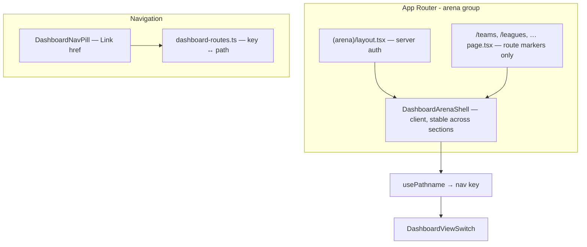

# Dashboard section routes — design spec

**Date:** 2026-05-20  
**Status:** Approved for implementation (user request: dedicated URLs per sidebar section; evaluate Redux)

## Problem

All panel sections render under `/dashboard` with client `useState` for the active section. The URL does not change when clicking sidebar items (e.g. Equipos), which breaks shareable links, browser history, and professional app expectations.

## Goals

1. Each sidebar section has a stable, bookmarkable path (e.g. Equipos → `/teams`).
2. Sidebar uses real navigation (`Link`), not in-place state toggles.
3. Keep existing auth gate for operator routes (Supabase + `dashboard_access`).
4. Do **not** introduce Redux unless global client state clearly requires it.

## Non-goals

- Redux or other global store for this change.
- Nested routes per league/team (future work).
- Changing API or database schema (`docs/DATABASE.md` unchanged).

## Approaches considered

| Approach | Pros | Cons |
|----------|------|------|
| **A. App Router URLs + `usePathname`** (recommended) | Native Next.js, shareable URLs, no new deps | Must avoid remounting data layer on section change |
| B. Query params (`/dashboard?section=teams`) | Single page file | Ugly URLs, weaker semantics |
| C. Redux + single `/dashboard` | Familiar pattern | Wrong tool for URL sync; adds boilerplate without fixing URLs |

**Recommendation:** A. Map `DashboardNavKey` → path; derive active section from `pathname`; use `Link` in the rail.

## Redux decision

**Do not adopt Redux** for sidebar navigation or `myLeagues` loading.

- **URL** is the source of truth for which section is active.
- **`useState`** remains appropriate for drawers, form keys, pagination loading flags, and fetched league aggregate (`myLeagues`).
- If cross-section cache becomes painful later, prefer a small **React Context** in the arena layout over Redux.

## Architecture

### Route map

| Section | Path |
|---------|------|
| Inicio | `/dashboard` |
| Ligas | `/leagues` |
| Fixture | `/fixture` |
| En vivo | `/live` |
| Equipos | `/teams` |
| Plantillas | `/players` |
| Sedes | `/venues` |
| Tabla | `/standings` |
| Disciplina | `/discipline` |
| Actas | `/reports` |
| Ajustes | `/settings` |

Login and OAuth callbacks continue to land on `/dashboard`.

### Layout persistence (critical)

Initial implementation mounted `DashboardArenaPage` on **each** route’s `page.tsx`. Client navigation between sections can **remount** the page tree and **re-fetch** `/api/leagues/my` on every click.

**Fix:** Mount `DashboardArenaShell` once in `(arena)/layout.tsx`. Section `page.tsx` files only exist to register URLs (minimal/null content). Shell reads `pathname` and renders `DashboardArenaLayout` + `DashboardViewSwitch`.

### Files (conceptual)

- `src/components/dashboard/nav/dashboard-routes.ts` — path map + helpers
- `src/components/dashboard/nav/dashboard-nav-config.ts` — `href` per item
- `src/components/dashboard/nav/DashboardNavPill.tsx` — `Link` instead of buttons
- `src/components/dashboard/DashboardArenaShell.tsx` — data + layout (client)
- `src/app/(arena)/layout.tsx` — server auth + shell wrapper
- `src/app/(arena)/*/page.tsx` — one export per section URL

## Error handling

- Unknown pathname under arena → `router.replace("/dashboard")`.
- Unauthenticated client → `router.replace("/")`.
- API 401 → redirect home; other errors → existing retry UI.

## Testing

- No unit test runner in project today; verify via `npm run build` and manual: click Equipos → URL `/teams`, back button works, no full reload flash between sections.

## Self-review

- No TBD sections.
- Redux explicitly rejected with alternative (Context later).
- Scope limited to routing/navigation; DB untouched.
