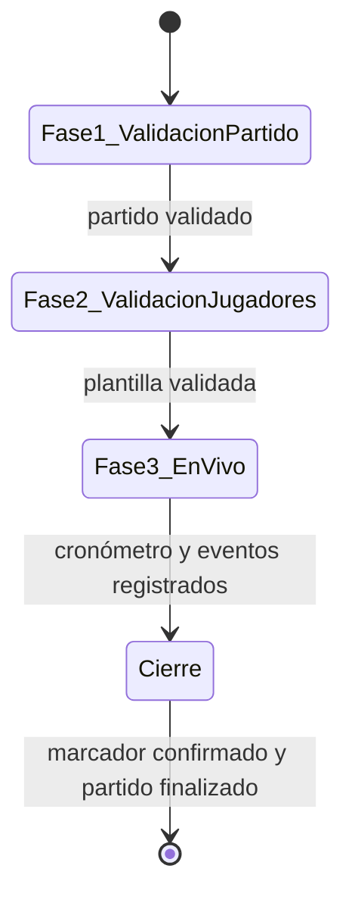

# Registro de incidencias en partido — lógica de negocio

**Fecha:** 2026-05-21  
**Alcance:** Flujo operativo para que un usuario/administrador de Tornea registre un partido desde la validación previa hasta el cierre con marcador y puntos.

## Objetivo

Permitir registrar un partido en tres fases secuenciales: validar datos del encuentro, validar jugadores que entran a jugar, y operar el partido en vivo (cronómetro + incidencias) hasta confirmar el marcador final y aplicar las reglas de puntos y walkover.

## Resumen del flujo

| Fase | Nombre | Resultado |
|------|--------|-----------|
| 1 | Validación de datos del partido | Datos del encuentro confirmados (editables hasta confirmar) |
| 2 | Validación de jugadores | Plantilla del partido cerrada por equipo |
| 3 | Partido en vivo | Cronómetro + registro de incidencias + cierre |

Un partido **no puede** pasar a la fase siguiente sin completar la anterior.

---

## Fase 1 — Validación de datos del partido

### Qué valida el usuario

Antes de dar el partido por validado, el usuario revisa y puede **editar**:

| Dato | Notas |
|------|--------|
| Equipos (local / visitante) | Deben ser distintos |
| Cantidad máxima de jugadores en cancha por equipo | Límite reglamentario del torneo/categoría |
| Minutos primer tiempo | Puede venir de la categoría; editable en el partido (`matches.report`) |
| Medio tiempo (descanso) | Minutos de pausa entre tiempos |
| Minutos segundo tiempo | Idem primer tiempo |
| Árbitro | Opcional; directorio de la liga |
| Fase del torneo | Jornada / ronda (`matchday`, `round_label`) |
| Cancha | `venue` del partido |

### Reglas

- Los cambios de duración en esta fase se guardan en el partido (`matches.report`: `firstHalfMinutes`, `halftimeBreakMinutes`, `secondHalfMinutes`); no modifican la categoría de origen.
- `regulation_minutes` = primer tiempo + segundo tiempo (sin contar el descanso).
- El usuario puede corregir cualquier campo **hasta** pulsar **Validar partido**.
- Tras validar, la fase 1 queda cerrada; reabrirla (si se permite) debe invalidar fases posteriores.

### Estado del partido

- Entrada: `scheduled` (u otro estado previo al acta).
- Salida de fase 1: partido listo para convocatoria (metadato de flujo; el estado global puede seguir siendo `scheduled` hasta iniciar el cronómetro).

---

## Fase 2 — Validación de jugadores

### Responsable

Usuario o administrador de Tornea con permiso sobre el torneo/partido.

### Proceso

1. Por cada equipo, el usuario valida **uno a uno** qué jugadores entran al partido.
2. Solo puede seleccionar jugadores que **pertenecen al equipo** del partido (roster de temporada / plantel del `season_team`).
3. Si un jugador no figura en el plantel pero debe jugar:
   - **Alta al momento**: crear/vincular jugador al equipo y añadirlo a la convocatoria del partido.
   - El alta no sustituye la validación: el jugador debe quedar explícitamente marcado como convocado.
4. No se puede validar más jugadores **en cancha** (titulares) que el máximo configurado en fase 1 por equipo.
5. Los suplentes en banco pueden registrarse aparte; el límite de “en cancha” aplica solo a titulares al inicio (y a jugadores actualmente en el campo durante el partido — ver sustituciones).

### Reglas

| Regla | Comportamiento |
|-------|----------------|
| Jugador ↔ equipo | Un jugador solo en la convocatoria del equipo al que pertenece en ese partido |
| Máximo en cancha | Bloquear validación si titulares > máximo permitido |
| Unicidad | Un jugador no puede aparecer en ambos equipos del mismo partido |
| Cierre de fase | Ambos equipos deben tener al menos el mínimo reglamentario de titulares validados (si el torneo lo exige) |

### Persistencia (referencia)

- Convocatoria por partido: `match_lineups` (`slot`: `starter` | `bench`).
- Alta express: jugador + vínculo al `season_team` + fila en `match_lineups`.

### Salida

- Plantilla validada para local y visitante.
- Habilita **Iniciar partido** (fase 3).

---

## Fase 3 — Inicio y desarrollo del partido

### Cronómetro

Al iniciar el partido:

1. Estado del partido → `live`.
2. Se registra `started_at`.
3. El cronómetro recorre en orden:
   - **Primer tiempo** (duración = `firstHalfMinutes`)
   - **Medio tiempo / descanso** (pausa; duración = `halftimeBreakMinutes`) — no cuenta como tiempo de juego
   - **Segundo tiempo** (duración = `secondHalfMinutes`)

El usuario puede pausar/reanudar el cronómetro según reglas de UI (no definidas aquí). Cada incidencia debe guardar **periodo** y **minuto** (y opcionalmente minuto de descuento).

Periodos de juego en base de datos (`football_period`): `first_half`, `second_half` (y extensiones futuras: `extra_first`, `extra_second`, `penalty_shootout`).

---

## Incidencias durante el partido

Todas las incidencias se registran **durante** el partido en vivo, asociadas a minuto/periodo y, cuando aplique, a jugador y equipo.

### Tipos de evento

| Evento | Asignación obligatoria | Reglas de negocio |
|--------|------------------------|-------------------|
| **Gol** | Equipo; goleador (opcional si autogol); asistencia opcional | Actualiza marcador en tiempo real; distinguir autogol |
| **Tarjeta** | Jugador; tipo amarilla o roja | Ver sección Tarjetas |
| **Cambio** | Jugador sale + jugador entra (mismo equipo) | Ver sección Cambios |
| **Falta** | Jugador infractor; equipo infractor | Ver sección Faltas |
| **Penalti** | Lanzador; equipo; resultado | Ver sección Penalti |
| **Asistencia** | Jugador asistente | Normalmente ligada a un gol; puede registrarse junto al gol |

### Gol

- Campos: equipo, `scorer_player_id`, `assist_player_id` (opcional), periodo, minuto.
- Tipos (`goal_kind`): juego abierto, penalti convertido, tiro libre, etc.
- **Autogol**: marca a favor del equipo contrario; `is_own_goal = true`.
- Los goles alimentan el marcador provisional; el marcador oficial se confirma al cierre.

### Tarjetas

| Tipo | Efecto |
|------|--------|
| Amarilla | Acumula en el historial del jugador en el partido |
| Roja directa | Jugador **expulsado**; no puede volver al campo |
| Segunda amarilla | Se registra como `second_yellow`; jugador **expulsado** |

**Regla de expulsión:** si un jugador acumula **2 amarillas** en el mismo partido → expulsión automática (registrar `second_yellow` o equivalente) y no puede recibir más incidencias de juego salvo las que el acta permita documentar.

Un jugador expulsado:

- No puede ser jugador “entra” en un cambio.
- Permanece en el acta; su estado en cancha pasa a expulsado.

Persistencia: `match_cards` (`card_kind`: `yellow`, `red`, `second_yellow`).

### Cambio de jugador

- Solo entre jugadores del **mismo equipo**.
- `player_out` debe estar actualmente en el campo (titular o entró por cambio previo).
- `player_in` debe estar en la convocatoria (`match_lineups`) o darse de **alta al momento** (misma regla que fase 2) y luego ejecutarse el cambio.
- Tras el cambio, el jugador que entra cuenta para el cupo en cancha; el que sale no.

Persistencia: `match_substitutions`.

### Faltas

- Cada falta se asigna a un **jugador** y al **equipo** infractor.
- El sistema lleva un **conteo de faltas por equipo** en el partido (agregado en memoria o derivado de `match_fouls`).
- Al llegar a **5 faltas acumuladas** de un equipo en el partido (regla Tornea / reglamento configurado):
  - **Recomendar** al usuario registrar **tiro libre** (aviso en UI; no bloquea otras acciones).
  - La falta queda registrada con jugador responsable.

Persistencia: `match_fouls` (clasificación `foul_kind`). La tarjeta por la misma jugada, si hay, va en `match_cards` y puede enlazarse con `match_card_id`.

### Penalti

- Penalti **durante el juego** (no tanda de definición): `match_penalty_attempts`.
- Registrar: equipo, lanzador, periodo, minuto, resultado (`scored`, `saved`, `missed`, etc.).
- Si convierte, enlazar o crear el **gol** correspondiente (`goal_kind`: `penalty_kick`).

### Asistencia

- Se asocia al **gol** (`assist_player_id` en `match_goals`).
- El asistente debe pertenecer al mismo equipo que el gol (salvo reglas especiales del deporte; en fútbol Tornea: mismo equipo).

---

## Marcador y cierre del partido

### Durante el partido

- El marcador se calcula en vivo a partir de goles (excluyendo autogoles mal asignados: autogol suma al rival).
- El usuario puede corregir/eliminar incidencias según permisos de edición del acta (definición de permisos fuera de este doc).

### Antes de finalizar

1. Mostrar **marcador provisional** vs **suma de goles registrados**.
2. El usuario **valida el marcador final** (`home_score`, `away_score`).
3. Si hay discrepancia, debe reconciliar (ajustar goles o marcador manual con motivo en `notes` / auditoría).

### Finalizar partido

- Estado → `finished` (o `walkover` si aplica no presentación).
- `ended_at` registrado.
- Persistir goles, tarjetas, cambios, faltas y penaltis ya validados.
- Actualizar **puntos en tabla** del torneo según reglas abajo.

---

## No presentación y puntos

| Situación | Resultado | Puntos |
|-----------|-----------|--------|
| Un equipo no se presenta | Pierde automáticamente | Ganador (presente): **3 puntos**. Perdedor (ausente): **0 puntos**. Marcador: victoria administrativa (definir goles por defecto del torneo, p. ej. 3-0) |
| Ambos equipos no se presentan | Partido sin ganador deportivo | **Ningún equipo recibe puntos** (0-0 en tabla o sin fila de puntos según reglamento) |
| Partido jugado con ganador | Resultado deportivo | Equipo ganador: **3 puntos**. Perdedor: **0 puntos**. Empate: puntos de empate según reglamento del torneo (si aplica; por defecto Tornea puede ser 1-1 — **confirmar en configuración de liga**) |

Estado recomendado para un solo ausente: `walkover` en `matches.status`.

---

## Reglas transversales

### Quién puede registrar

- Usuario con rol de administración del torneo o delegado del partido (permisos exactos en capa de autorización).

### Jugador en cancha vs convocado

- Solo jugadores **convocados** (`match_lineups`) pueden recibir goles, tarjetas, faltas, penaltis y participar en cambios.
- Titulares + entrados por cambio − expulsados − salidos por cambio = jugadores **en campo** para validaciones de nuevas incidencias.

### Orden y auditoría

- Cada incidencia: timestamp, usuario que registra (`recorded_by_user_id` donde exista).
- Preferir no borrar incidencias en partidos `finished`; usar corrección con traza de auditoría.

### Coherencia con disciplina

- Tarjetas en acta (`match_cards`) son la fuente para amarillas/rojas del partido.
- Faltas (`match_fouls`) documentan la jugada; sanciones de comité (`sanctions`) son **post-partido** y opcionales.

---

## Mapeo a persistencia (referencia técnica)

| Concepto de negocio | Tabla / campo |
|---------------------|---------------|
| Partido y marcador | `matches` (`home_score`, `away_score`, `status`, `started_at`, `ended_at`, `report`) |
| Convocatoria | `match_lineups` |
| Gol / asistencia | `match_goals` |
| Tarjeta | `match_cards` |
| Cambio | `match_substitutions` |
| Falta | `match_fouls` |
| Penalti (juego) | `match_penalty_attempts` |
| Puntos en clasificación | `season_standings` / lógica de actualización de `points` por equipo |

---

## Fuera de alcance (v1 de este documento)

- Tanda de penales (`penalty_shootouts`) para desempate.
- Prórroga (`extra_first`, `extra_second`) salvo que el torneo la active después.
- Sanciones disciplinarias del comité tras revisión del acta.
- VAR / revisión de jugadas.

---

## Criterios de aceptación (checklist)

- [ ] Fase 1: no avanzar sin validar datos obligatorios del partido.
- [ ] Fase 2: no seleccionar jugadores de otro equipo; respetar máximo en cancha; alta express operativa.
- [ ] Fase 3: cronómetro primer tiempo → descanso → segundo tiempo.
- [ ] Registrar gol, tarjeta (2 amarillas = expulsión), cambio, falta (aviso a 5 por equipo), penalti y asistencia en gol.
- [ ] Validar marcador final antes de `finished`.
- [ ] Walkover unilateral: 3 puntos al presente; doble ausencia: 0 puntos a ambos.
- [ ] Ganador deportivo: 3 puntos al ganador.
